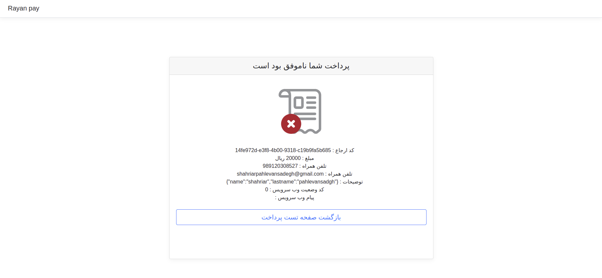

# Rayan Pay HP Sample Code


این نمونه کد فقط ساختار کار با درگاه پرداخت رایان پی با کد php بود و همین طور تست اکانت شما می باشد
در این نمونه کد که بدون دیتا بیس نوشته شده فقط از نوشتن در فایل کمک گرفته 
اطلاعات اصلی را در فرم وارد کرد ارسال کنید تا به درگاه بانک وصل شود  تا پرداخت انجام داده و پس از آن بازگشت می کند و نتیجه و داده ارسالی را به شما نمایش داده

مثلا در صورت نصراف از پرداخت به شکل زیر نمایش داده می شود


به علت استغاده از ذخیره سازی فایل برای این پروژه فایل storage.txt باید صاحب و گروهش user وب سرویستان باشد مثلا با دستور زیر در لینوکس باید اینکار شود

sudo chown www-data:www-data ./storage.txt

فایل فقط برای ذخیره سازی نام کاربری و اطلاعات اصلی در فرم گرفته شده  می باشد در صورت استفاده شخصی می توانید در فایل env. خود ذخیره کنید

[Link Demo](https://rayanpay.com/PHPSampleCodeTest/v2/)

# سرویس گرفتن توکن احراز هویت کلاینت سمت ما:

```
POST:https://pms.rayanpay.com/api/v1/auth/token/generate

body:
{
  "clientId": "شناسه مشتری",
  "userName": "نام کاربری",
  "password": "پسورد"
}
 مقدار بازگشتی یک رشته می باشد که
یک شناسه یکبار مصرف یکتا است که باید در هدر احراز هویت درخواست های بعدی  قرار بگیرد 
```

# سرویس درخواست پرداخت:

```
POST:https://pms.rayanpay.com/api/v1/ipg/payment/start

Authorization Header: Bearer Token(گرفته شده از سرویس توکن:که بهتر است برای هر بار درخواست مجدد گرفته شود)
Body:
{
  "referenceId": یک شناسه عددی یکتا است که کلاینت تولید میکنید و برای سرویس ما میفرستد و جهت رهگیری درخواست پرداختش و جلوگیری از ارسال دخواست های تکراری استفاده میشود,
  "amount":  مبلغ پرداختی به ریال که عددی  میباشد,
  "msisdn": "شماره موبایل پرداخت کننده که باید به صورت رشته و فرمت موبایل داشته باشد وگرنه سرویس 400 میدهد و فرستادنش اختیاری است",
  "gatewayId": 100,//عدد ثابت 100
  "callbackUrl": "آدرسی در سمت کلاینت که بانک پس از پرداخت به این صفحه پرداخت کننده را هدایت خواهد کرد",
}

response: OK

response body:
{
bankRedirectHtml: رشته html که باید در سایت کلاینت لود شود تا درگاه بانک ملت را ببیند
این صفحه "اچ تی ام ال" حاوی توکن بانک است و وقتی در صفحه لود میشود به درگاه بانک ریدایرکت میشود
}
```


#سرویس تایید پرداخت:

```
POST:https://pms.rayanpay.com/api​/v1​/ipg​/payment​/response​/parse

Authorization Header: Bearer Token(گرفته شده از سرویس توکن:که بهتر است برای هر بار درخواست مجدد گرفته شود)
Body:
{
  "referenceId":  شناسه عددی  کلاینت ,
  "header": "این هدر از هدر ریکوئست بانک خوانده میشود",
  "content": "این کانتنت از کانتنت ریکوئست   بانک خوانده میشود"
}

response: OK(موفق)
response body
{
PaymentId,
HashedBankCardNumber,
EndDate :فقط در صورتی پر است که پرداخت به صورت حتمی موفق یا حتمی نا موفق باشد و در صورتی که وضعیت پرداخت نامشخص باشد این فیلد هم خلی خواهد بود
}

اگر وضعیت پاسخ همان httpStatusCode غیر از 200 باشد :
* 401 توکن نامعتبر 
* 600 وضعیت نامشخص
* 601 پرداخت ناموفق  
* 602 پرداخت وجود ندارد
* 609 وضعیت پرداخت برای تایید کردن نامعتبر است
```
